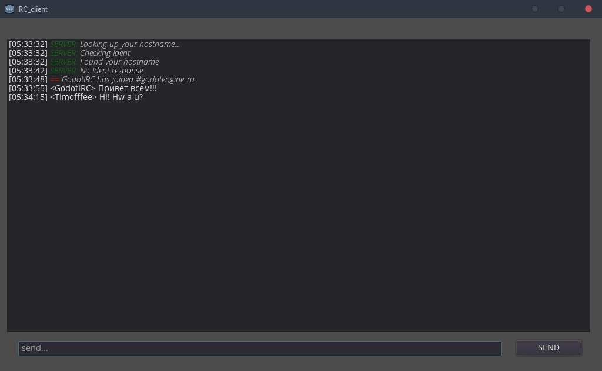

# GodotIRC
IRC client on Godot engine

ver. 0.0.17

Patreon: https://www.patreon.com/timofffee

Features:
* Connect to irc servers
* Enter password
* Display the JOIN, QUIT, PART, NOTICE, PRIVMSG
* Auto answer on PING
* Ready for code enhancements and changes
* Russian language support
* Add support for BB-code (Color, bold/italic text)

Plans:
* Enter commands, using a slash (/JOIN, /MSG, etc.)
* Add more commands to display
* Sounds for comfortable tracking of events
* Support for multiple channels simultaneously
* Plugin for Godot engine (GodotIRC Plugin)
